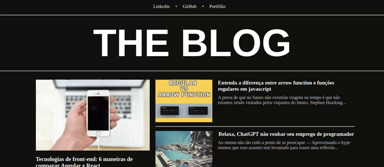

# THE BLOG

Foi desenvolvido com [Angular CLI](https://github.com/angular/angular-cli) na versão 14.1.2.

## Sobre

Esse projeto foi desenvolvido durante a formação de `Desenvolvimento Frontend com Angular` da instituição [DIO](https://web.dio.me/). Nesso projeto foi trabalhado em como montar componentes no angular reutilizaveis e como deixar seus conteudos dinâmicos.

## Tech Stack

- `Angular`
- `TypeScript`
- `HTML5`
- `CSS3`

